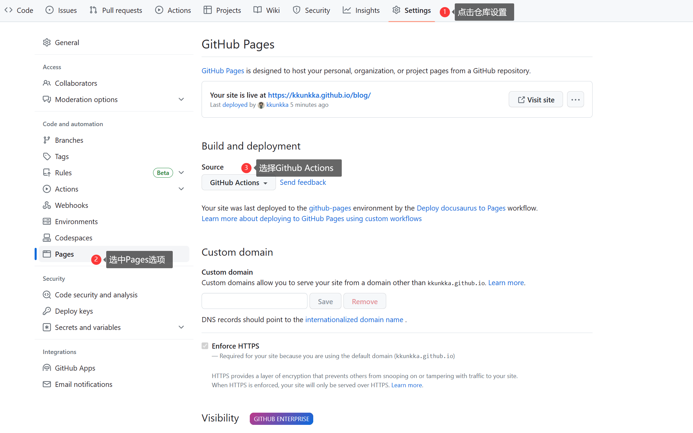
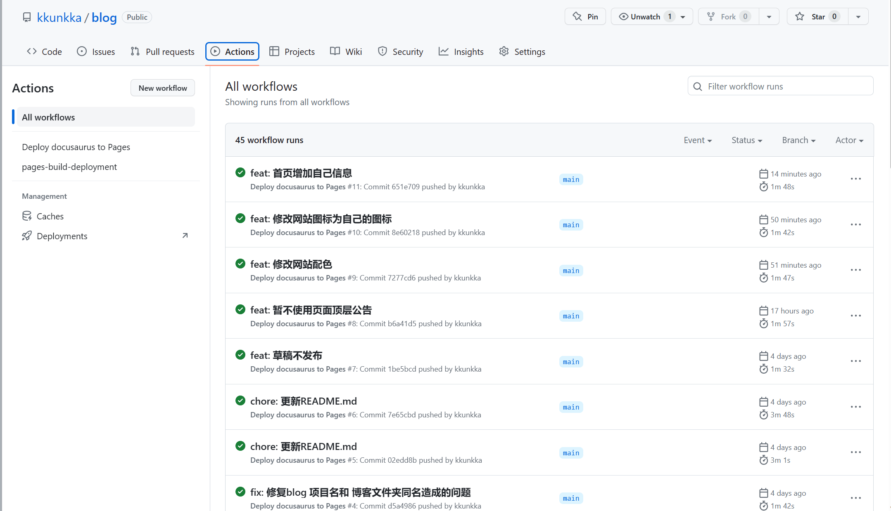

# 部署Docusaurus到Github Pages

本文介绍了如何使用 Github Action 部署 Docusaurus 到 Github Pages

<!--truncate-->

---

## Github仓库设置



## 编写Workflows文件

在项目根目录下编写github的workflows文件


/.github/workflows/docusaurus.yml

```yml
# Simple workflow for deploying static content to GitHub Pages
name: Deploy docusaurus to Pages

on:
  # Runs on pushes targeting the default branch
  push:
    branches: ["main"]

  # Allows you to run this workflow manually from the Actions tab
  workflow_dispatch:

# Sets permissions of the GITHUB_TOKEN to allow deployment to GitHub Pages
permissions:
  contents: read
  pages: write
  id-token: write

# Allow only one concurrent deployment, skipping runs queued between the run in-progress and latest queued.
# However, do NOT cancel in-progress runs as we want to allow these production deployments to complete.
concurrency:
  group: "pages"
  cancel-in-progress: false

jobs:
  # Single deploy job since we're just deploying
  deploy:
    environment:
      name: github-pages
      url: ${{ steps.deployment.outputs.page_url }}
    runs-on: ubuntu-latest
    steps:
      - name: Checkout
        uses: actions/checkout@v3
      - name: Setup pnpm
        uses: pnpm/action-setup@v2.2.4
        with:
          version: latest
          run_install: false
      - name: insatll
        run: | 
          pnpm install --frozen-lockfile
          pnpm build
      - name: Setup Pages
        uses: actions/configure-pages@v3
      - name: Upload artifact
        uses: actions/upload-pages-artifact@v1
        with:
          # Upload entire repository
          path: './build'
      - name: Deploy to GitHub Pages
        id: deployment
        uses: actions/deploy-pages@v2

```

## 完成

现在推送任意提交到main分支(或者在workflows文件中指定的其他分支), 即可触发GitHub Action, 自动构建并部署GitHub Pages




假如构建失败, 需要点进去某次失败的构建, 查看具体失败原因进行相应修正

## 参考链接
- [Docusuaurus官方文档](https://docusaurus.io/zh-CN/docs/deployment#deploying-to-github-pages)
- [Github官方文档](https://docs.github.com/zh/pages/getting-started-with-github-pages/configuring-a-publishing-source-for-your-github-pages-site#%E4%BD%BF%E7%94%A8%E8%87%AA%E5%AE%9A%E4%B9%89-github-actions-%E5%B7%A5%E4%BD%9C%E6%B5%81%E8%BF%9B%E8%A1%8C%E5%8F%91%E5%B8%83)