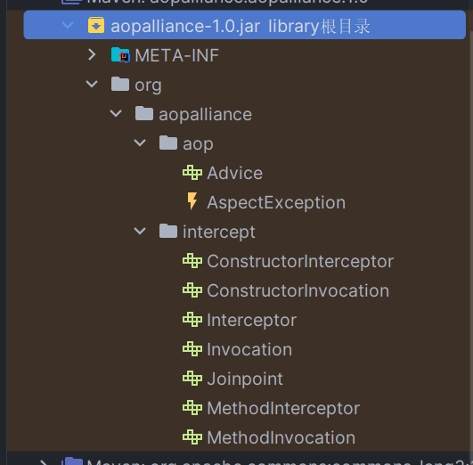
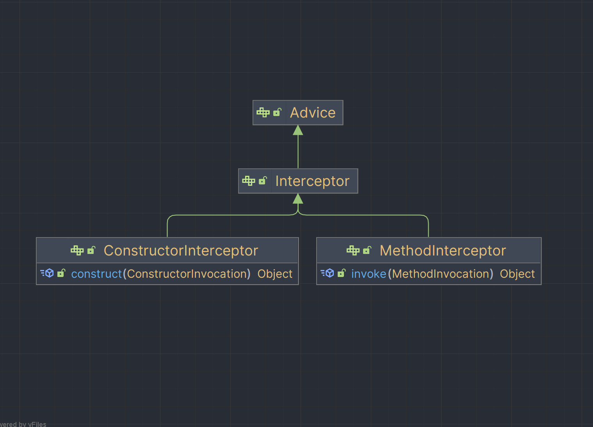
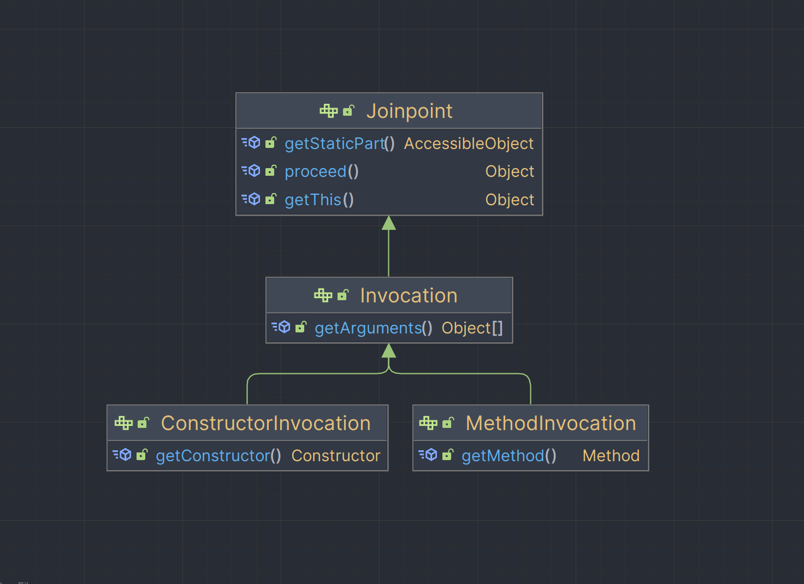

代理模式是一种常用的设计模式, 使用一个代理对象来代替真实对象的访问, 能够在不修改真实对象的情况下增加自定义操作, 提供额外的功能

广泛用于AOP框架, 日志框架, 事务处理, 权限控制等实际场景
<!--truncate-->

## 静态代理
在编译期间就已经确定了代理类和被代理类之间的关系, 需要手动编写代理类的相关代码

这种方式实现比较简单, 但是非常不灵活, 每个代理类都要写一遍, 实际很少使用这种方式

接口
```Java
public interface People {
	void eat();
}
```
被代理类
```Java
public class PeopleImpl implements People {
	@Override
	public void eat() {
		System.out.println("饿啊, 吃点东西");
	}
}
```

代理类
```Java
public class PeopleProxy implements People {
	private final People people;

	public PeopleProxy(People people) {
		this.people = people;
	}

	public PeopleProxy() {
		this.people = new PeopleImpl();
	}

	@Override
	public void eat() {
		System.out.println("吃东西前先洗手");
		people.eat();
		System.out.println("吃完再擦个嘴");
	}
}
```

使用
```java
People people = new PeopleProxy(new PeopleImpl()); 
people.eat();
```

## 动态代理
代理类在编译时不存在, 运行时才动态生成

### JDK动态代理
- 利用反射在运行时生成代理类
- 被代理类必须实现接口
- 核心是 Proxy 类和 InvocationHandle 接口
- 一个代理可以处理多个接口, 不需要重复编写相同内容

被代理类
```Java
public class PeopleImpl implements People {
	@Override
	public void eat() {
		System.out.println("饿啊, 吃点东西");
	}
}
```

代理类
```Java
public class PeopleProxy implements InvocationHandler {
	private final People people;

	public PeopleProxy() {
		this.people = new PeopleImpl();
	}

	public PeopleProxy(People people) {
		this.people = people;
	}

	public People Instance() {
		Class<? extends People> clazz = this.people.getClass();
		return (People) Proxy.newProxyInstance(clazz.getClassLoader(), clazz.getInterfaces(), this);
	}

	@Override
	public Object invoke(Object proxy, Method method, Object[] args) throws Throwable {
		System.out.println("吃东西前先洗手");
		Object invoke = method.invoke(this.people, args);
		System.out.println("吃完再擦个嘴");
		return invoke;
	}
}
```

### Cglib
- 被代理类可以没有实现接口
- 通过继承实现代理, 因此被代理类不能是final
- 核心是 Enhancer 类和 MethodInterceptor 接口

引入依赖
```pom.xml
<dependency>
	<groupId>cglib</groupId>
	<artifactId>cglib</artifactId>
	<version>3.3.0</version>
</dependency>
```

被代理类
```Java
public class PeopleImpl{ //没有实现任何接口
	public void eat() {
		System.out.println("饿啊, 吃点东西");
	}
}
```

代理类
```Java
public class PeopleProxy implements MethodInterceptor {

	public static Object instance(Class<?> clazz) {
		Enhancer enhancer = new Enhancer();
		enhancer.setClassLoader(clazz.getClassLoader());
		enhancer.setSuperclass(clazz);
		enhancer.setCallback(new PeopleProxy());
		return enhancer.create();
	}

	@Override
	public Object intercept(Object o, Method method, Object[] args, MethodProxy methodProxy) throws Throwable {
		System.out.println("吃东西前先洗手");
		Object invoke = methodProxy.invokeSuper(o, args);
		System.out.println("吃完再擦个嘴");
		return invoke;
	}
}
```

## 遇到问题
由于Java版本问题(我用的Java17), 使用Cglib的过程中出现了错误, Java9以下的能正常运行

### 问题描述
:::danger 错误

Caused by: net.sf.cglib.core.CodeGenerationException: java.lang.reflect.InaccessibleObjectException-->Unable to make protected final java.lang.Class java.lang.ClassLoader.defineClass(java.lang.String,byte[],int,int,java.security.ProtectionDomain) throws java.lang.ClassFormatError accessible: module java.base does not "opens java.lang" to unnamed module @5d6f64b1

:::

### 解决方法
:::tip 解决
这个错误是因为 JDK 9 及以上版本引入了一个名为 Java 模块系统的功能，通过限制模块之间的访问来增强应用程序的安全性和可靠性。而在该错误信息中，是因为在使用 CGLIB 动态生成类的过程中需要通过反射访问 `ClassLoader.defineClass` 方法，但该方法对于当前的 Java 模块系统来说不是公开的 API，并没有在 `java.lang` 包中对所有模块开放。

解决该问题需要通过将 JVM 启动参数设置为 `--add-opens java.base/java.lang=ALL-UNNAMED`，解除对 `ClassLoader.defineClass` 的访问限制。

可以尝试在启动代码中添加类似以下的 VM 参数：

```
--add-opens java.base/java.lang=ALL-UNNAMED
```

或者在使用 CGLIB 动态生成类的模块的 module-info.java 文件中添加以下内容：

```
open <module_name> to org.springframework.cglib.core;
```

这样就可以解决该问题。请注意，为了确保应用程序的安全性，请务必谨慎使用此类参数和操作。
:::

## AOP
### 概念
AOP(Aspect Oriented Programming)是一种面向切面的编程范式, 在Java中常常用代理来实现AOP
- Aspect 切面 指一个横跨多个对象的功能, 比如事务管理
- Join Point 连接点 指那些被拦截到的点, 程序运行过程中的某一行为
- Advice 通知 指拦截到连接点之后要织入的具体逻辑, 执行的代码
- PointCut 切入点 指连接点具体要切入的位置, 关联连接点和通知

### AOP Alliance
AOP Alliance 是一个定义了通用AOP操作的接口框架, 提供了很多标准的AOP接口和类, 广泛用于Java上各种AOP框架

引入依赖
```pom.xml
<dependency>
	<groupId>aopalliance</groupId>
	<artifactId>aopalliance</artifactId>
	<version>1.0</version>
</dependency>
```

jar包目录结构:



结构还是比较简单的, 主要对象之间关系有两个
1. 通知接口

- Advice和Interceptor接口没有定义方法属于标记接口
- Advice接口表示连接点要处理的通用处理逻辑
- Interceptor接口是使用拦截处理来实现Advice接口的一种方式

2. 连接点接口

- JoinPoint接口表示连接点
- Invocation接口表示程序执行中的某个调用, 作为一个连接点可以被拦截器调用

下面还有具体的构造器和方法调用的接口表示对应拦截器和连接点, 就不多说了