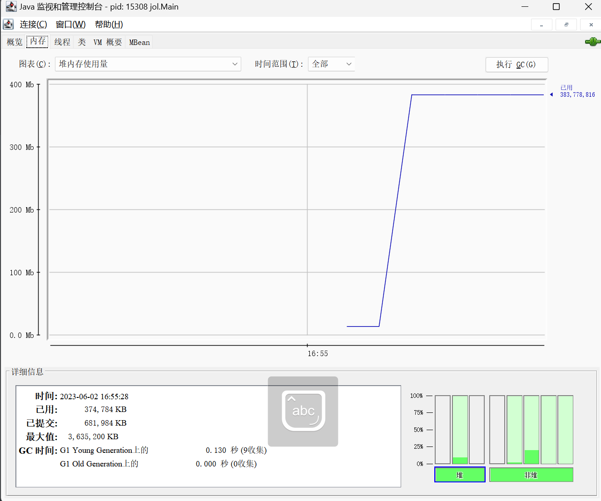
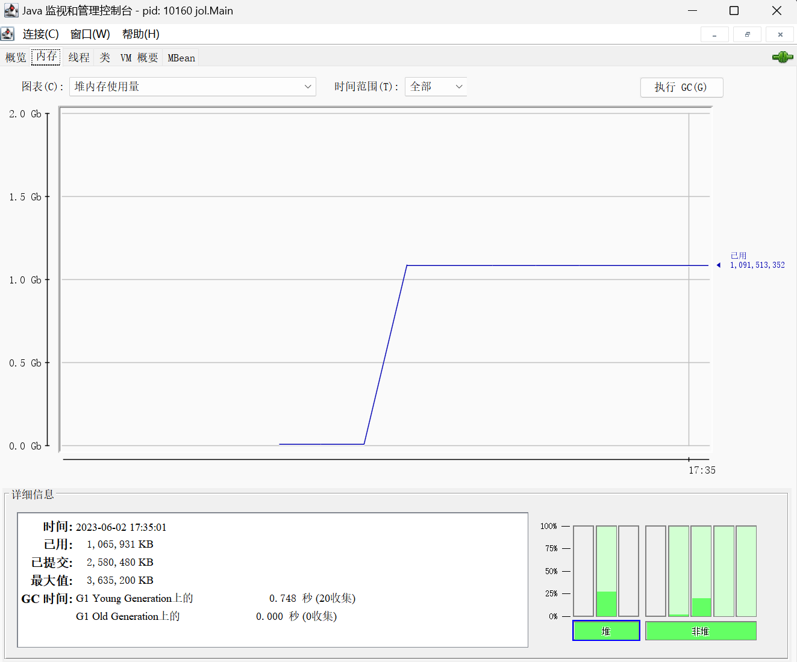

一个 Java 对象由三部分组成
- 对象头
- 实例数据
- 对齐填充

要计算一个对象的大小, 只需要算出这三部分的大小即可

以下分析内容都基于 64 位 HotSpot 虚拟机, 并开启指针压缩
<!--truncate-->
## Java 基本类型
Java 虽然是一门面向对象的语言, 但是仍然有八种基本数据类型, 它们不属于对象, 直接存放在栈中

- boolean 1字节, 布尔类型, 只能为`true`或者`false` 
- char 2字节, 无符号整数类型, 用于表示 Unicode 字符
- byte 1字节, 有符号整数类型, 取值范围 -128 到 127
- short 2字节, 有符号整数类型, 取值范围 -32768 到 32767
- int 4字节, 有符号整数类型, 取值范围 -2147483648 到 2147483647
- long 8字节, 有符号整数类型, 取值范围 -9223372036854775808 到 9223372036854775807
- float 4字节, 单精度浮点数类型
- double 8字节, 双精度浮点数类型

## 对象头
每个 Java 的对象都具有一个对象头, 它保存着一些附加的元数据, 通常包括以下内容
- Mark Word: 标记字 存储对象的一些标记信息, 比如垃圾回收的标记, 对象的 Hash Code 和 锁状态等, 占 8 个字节
- Class Pointer: 类型指针 指向该对象所属类的元数据的指针, 用于判断对象属于哪个类, 默认开启指针压缩情况下占 4 个字节
- Array Length: 如果这个对象是个数组, 那么还会存储这个数组的长度, 长度是个 `int` , 占 4 个字节

## 对齐填充
这个跟 Java 虚拟机相关, 在 HotSpot 虚拟机中, 要求对象的起始地址必须是 8 字节的整数倍, 因此对象的大小不是 8 字节的整数倍的话, 会自动填充数据成 8 字节的整数倍

## 使用 jol 分析对象大小
JOL 全称 Java Object Laryout, 是一个用来分析 Jvm 中对象布局的工具

### 0. 引入 maven 依赖
```pom.xml
<dependency>
    <groupId>org.openjdk.jol</groupId>
    <artifactId>jol-core</artifactId>
    <version>0.17</version>
</dependency>
```

### 1. 分析一个简单对象

先新建一个简单对象
```Java
class Tree {
	int height;
}
```

那么创建一个 `Tree` 对象会在内存中占多少空间呢?

首先它的对象头占12个字节(标记字 8 字节, 类型指针 4 字节), 然后它有一个 `int` 类型的 `height` 实例字段, 占 4 字节, 加起来一共 16 字节, 刚好是 8 字节的整数倍, 因此不需要对齐填充, 最终结果就是 16 字节

最后用代码来验证我们的分析是否正确

```Java
public class Main {
	public static void main(String[] args) {
		Tree tree = new Tree();
		System.out.println(ClassLayout.parseInstance(tree).toPrintable());
	}
}
```

输出结果: 

```Java
Tree object internals:
OFF  SZ   TYPE DESCRIPTION               VALUE
  0   8        (object header: mark)     0x0000000000000001 (non-biasable; age: 0)
  8   4        (object header: class)    0x00c01200
 12   4    int Tree.height               0
Instance size: 16 bytes
Space losses: 0 bytes internal + 0 bytes external = 0 bytes total
```

代码运行的结果和我们的分析完全一致, 一个 `Tree` 类型的实例所占空间就是 16 字节

### 2. 分析含有其他对象的情况
将其他对象放入 `Tree` 中, 看看这时候它占多少空间

```Java
class Tree {
	int height;
	double width; 
	Apple apple;
}

class Apple {
	int weight;
}
```

和之前一样 `Tree` 实例对象的对象头仍是 12 字节( 8 字节的标记字, 4 字节的类型指针)

字段 `height` 是 `int` 类型, 占 4 字节, `width` 字段是 `double` 类型, 占 8 字节, 最后 `apple` 字段是个对象的引用, 它是一个指向另一个对象地址的指针, 占 4 字节, 共占 28 字节

由于 28 不是 8 的整数倍, 因此要加上 4 字节的填充对齐数据, 最后整个对象所占空间即为 32 字节

代码实际运行结果也和我们分析的一样
```Java
Tree object internals:
OFF  SZ        TYPE DESCRIPTION               VALUE
  0   8             (object header: mark)     0x0000000000000001 (non-biasable; age: 0)
  8   4             (object header: class)    0x00c01200
 12   4         int Tree.height               0
 16   8      double Tree.width                0.0
 24   4       Apple Tree.apple                null
 28   4             (object alignment gap)    
Instance size: 32 bytes
Space losses: 0 bytes internal + 4 bytes external = 4 bytes total
```

### 3. 分析用 List 存储大量数据时占用空间
如果我们在内存中存了大量数据, 这个时候占了多少内存? 根据上面的内容, 我们来大致估算一下

首先创建一个 `List` 存入 1 千万的 `Tree` 对象
```
public class Main {
	public static void main(String[] args) {
		int n = 1000 * 10000;
		List<Tree> treeList = new ArrayList<>(n);
		for (int i = 0; i < n; i++) {
			treeList.add(new Tree());
		}
	}
}
```

一个 `Tree` 对象占 32 字节, 1 千万个 `Tree` 对象就占用了 320,000,000 字节, 大约是 305M

`ArrayList` 内部使用一个数组来存放数据, 数组中存的其实就是指向对象的指针, 开启指针压缩情况下一个指针是占 4 个字节, 1 千万个指针占用了 40,000,000 字节, 大概就是 38M

加起来是 360,000,000 字节, 大概占 343M 内存

因为占用空间最多的部分都在这 1 千万的数据中, 其他占用小的就忽略不计

最后用 jconsle 工具来看一下程序启动后内存的使用情况, 和我们分析的一样 



### 4. 分析用 HashMap 存储大量数据时占用空间
`HashMap` 内部是用一个数组加链表(红黑树)的结构存数据, 而数组中存的对象是 `Node`, 它们的结构如下

```Java
static class Node<K,V> implements Map.Entry<K,V> {
        final int hash;
        final K key;
        V value;
        Node<K,V> next;
}
```

```Java
static final class TreeNode<K,V> extends LinkedHashMap.Entry<K,V> {
        TreeNode<K,V> parent;  // red-black tree links
        TreeNode<K,V> left;
        TreeNode<K,V> right;
        TreeNode<K,V> prev;    // needed to unlink next upon deletion
        boolean red;
}
````

按照老规矩, 一个 `Node` 对象占用空间为: 对象头 12 字节 + `int` 类型的 `hash` 字段 4 字节 + 字段 `key` 的引用指针 4 字节 + 字段 `value` 引用指针 4 字节 + `next` 的引用指针 4 字节 = 28 字节, 不是 8 的整数倍, 再填充 4 字节, 结果是 32 字节

同理可得一个 `TreeNode` 对象占用空间也是 32 字节


如果我们 `Map` 中存的 `key` 和 `value` 都是 `Tree`, 那么一个节点的的总大小为 (32 + 32 + 32) * 10,000,000 = 640,000,000 字节	

另外, `HashMap` 在初始化大小时, 默认会按照 2 的倍数来设置, 所以我们将 `HashMap` 的初始化大小设置为 1 千万时, 实际上数组大小是 16,777,216 , 数组使用的引用指针总所占空间为 4 * 16,777,216 = 67,108,864 字节

`HashMap` 的 `Node` 和 `TreeNode` 实际大小是 32 * 10,000,000 = 320,000,000 字节

当我们往 `HashMap` 中放入 1 千万个数据时, 它们所消耗的内存就大概为 1,027,108,864 字节 大概占 979M 内存

```Java
public class Main {
	public static void main(String[] args) throws InterruptedException {
		int n = 10000000;
		HashMap<Tree, Tree> treeMap = new HashMap<>(n);
		for (int i = 0; i < n; i++) {
			treeMap.put(new Tree, new Tree());
		}
	}
}
```

