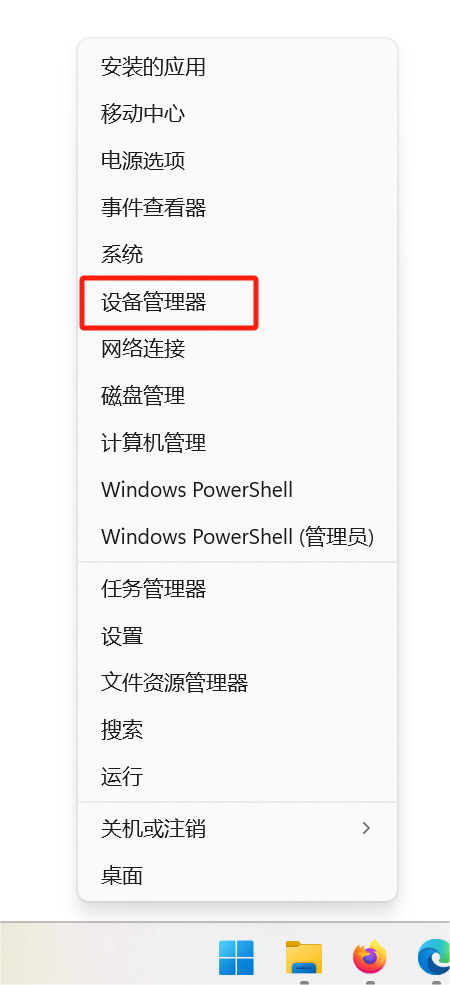
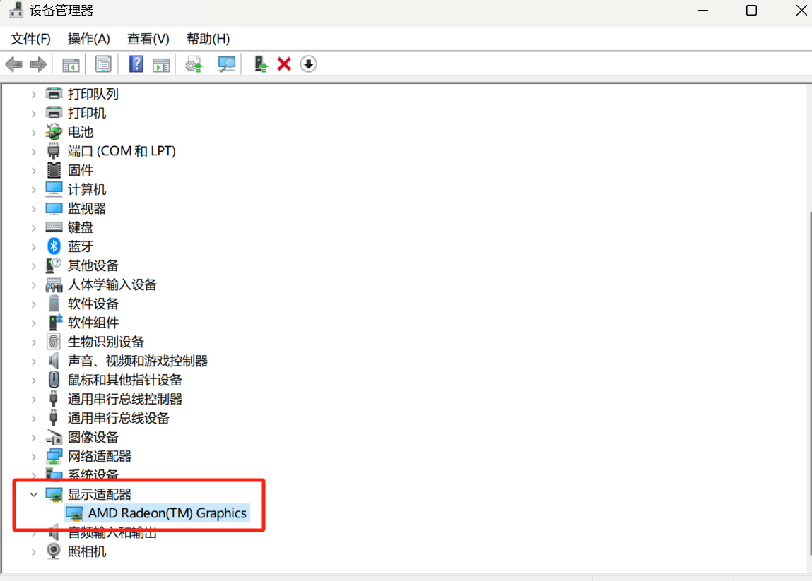
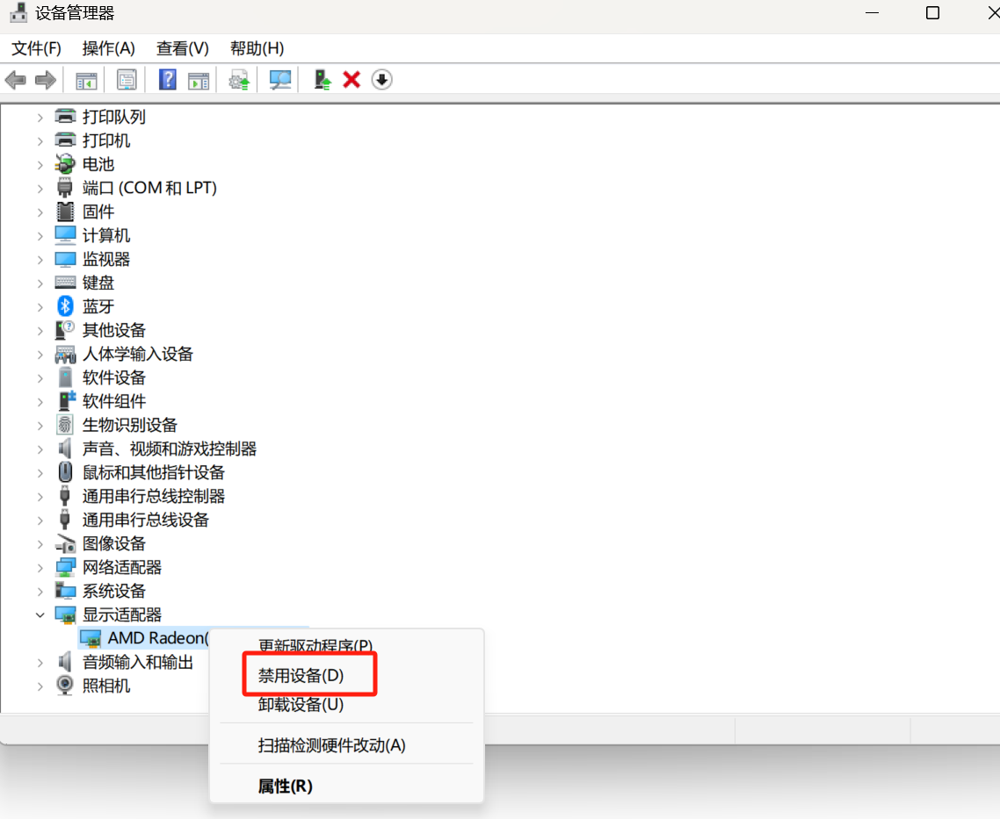
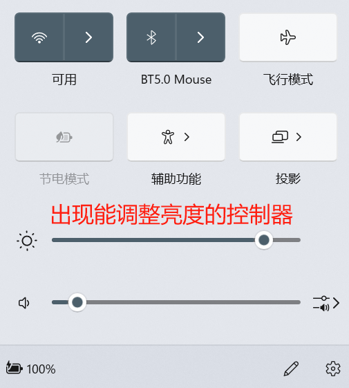

今天不知道咋回事笔记本电脑的屏幕亮度特别亮, 而且平时调节屏幕亮度的控制面板也没有调节亮度的控制器, 看得我眼睛快瞎了,研究半天终于恢复正常
(实际上是因为windows更新导致amd显卡掉驱动了)

<!--truncate-->

## 解决方法

打开电脑的设备控制器 (右击左下角windows图标)

点击显示适配器

右击显卡设备(没弄好之前有个黄色感叹号图标, 我这里已经恢复正常, 所以是正常图标)

点击禁用, 再点击启用

恢复正常

