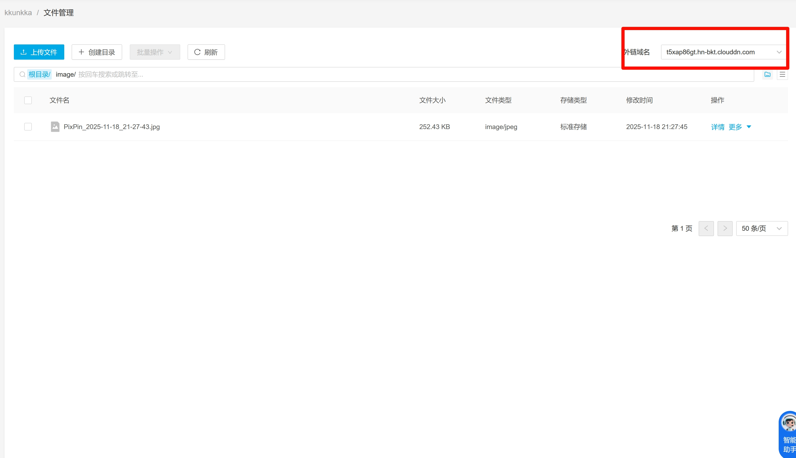

## 概要

使用[七牛云](https://qiniu.com)的对象存储作为图床

通过[picgo](https://picgo.github.io/PicGo-Doc/)自动上传图片并获取链接

<!--truncate-->

## 七牛云

个人每月可以有 10G 的免费额度，自己上传点图片完全够用了

因此选择七牛云作为图床

1. 创建账号
2. 创建对象存储 Kodo
3. 新建空间
   1. 存储名字不能重复
   2. 存储区域后面要用，先记下来
   3. 访问控制设为公开，能让别人访问到自己上传的图片
4. 空间管理中点击文件管理，有个外链域名，记下来
   
5. 点击右上角个人设置
6. 在密钥管理中新增 AccessKey/SecretKey

## PicGo

1. 到[PicGo下载页](https://picgo.github.io/PicGo-Doc/zh/guide/#%E4%B8%8B%E8%BD%BD%E5%AE%89%E8%A3%85)下载安装
2. 点开图床配置中的七牛云配置
3. 填入刚刚新增的两个密钥
4. Bucket 就是七牛云创建空间时候填的唯一不重复名字
5. 访问网址就是外链域名
6. 存储区域要根据[文档](https://developer.qiniu.com/kodo/1671/region-endpoint-fq)查阅，我这里用的是华南-广东，即 z2

## 大功告成

随便上传个文件试试吧
